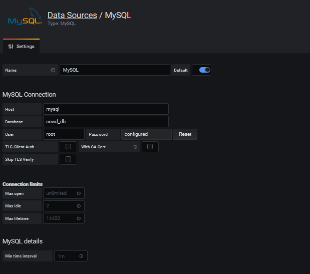
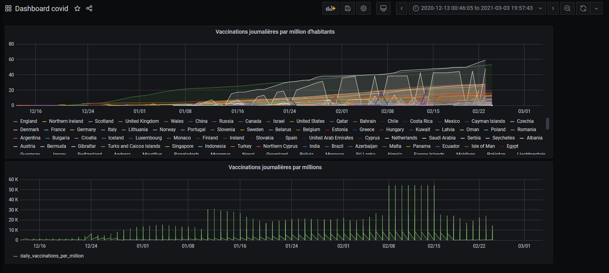

# P24_Grafana_Docker

Aude, Ludivine

__Objectifs :__
- préparer des conteneurs Docker pour des outils de Dataviz
- technologies retenues : MySQL et GRAFANA. Seveur Linux.

### Commandes de base sans Docker-Compose

#### Accéder au seuveur

`ssh user1@10.10.51.157` 
+renseigner le mot de passe

#### Téléchargement des images
__mysql__ 
`docker run --name mysql -p 4406:3306 -v /home/mysql:/var/lib/mysql -e MYSQL_DATABASE=covid_db -e MYSQL_USER=root -e MYSQL_ROOT_PASSWORD=MY_PASSWORD -d mysql:5.7`

- `-p` : ports exposés (système hôte : port d'écoute)
- `-e` : instructions d'environnement (optionnel). Ici on précise la Database et les identifisants de connexion pour démarrer immédiatement mysql.
- `-d` : mode détaché 
- `-v` : création du volume. Ici les infos du container seront stockées sur le système hôte (serveur) dnas le dossier `/home/mysql`

__grafana__ 
`docker run -d -p 3000:3000 grafana/grafana` 

#### Stocker les données

La base de données utilisée est un fichier SQL (généré sous phpMyAdmin à partir du CSV des données vaccinales disponible sur [Kaggle](https://www.kaggle.com/gpreda/covid-world-vaccination-progress)

Copie du fichier enregistré en local dans le volume dédié sur le serveur : 
`docker cp table_2.sql mysql:/var/lib/mysql` 
`cd /var/lib/mysql` 
`mysql covid_db < table_2.sql -p` 

#### Commandes utiles

démarrer le shell du container mysql : 
`docker exec -it mysql /bin/bash` 
puis démarrer mysql dans ce container : 
`mysql -uroot -p` 
ou en une seul commande depuis le shell serveur : 
`docker exec -it mysql mysql -uroot -p` 
arrêter/démarrer le container : 
`docker stop mysql` 
`docker start mysql` 

#### Accèder à Grafana sur le serveur  
Dans un navigateur, entrer l'adresse du serveur suivie du n° de port d'écoute de Grafana 
`10.10.51.157:3000`     
+entrer les identifiants (à la premiere identification : admin admin) 

Dans la barre de navigation, se rendre dans 
_configuration > datasources > add_datasource > mysql_

Renseigner les champs pour accèder à mysql : 

#### Générer les graphiques
Les données vaccinales sql sont maintenant disponibles sur Grafana.  
Se rendre sur l'onglet _Dashboard_ ou _Explore_ de la barre de navigation pour générer la dataviz. 

